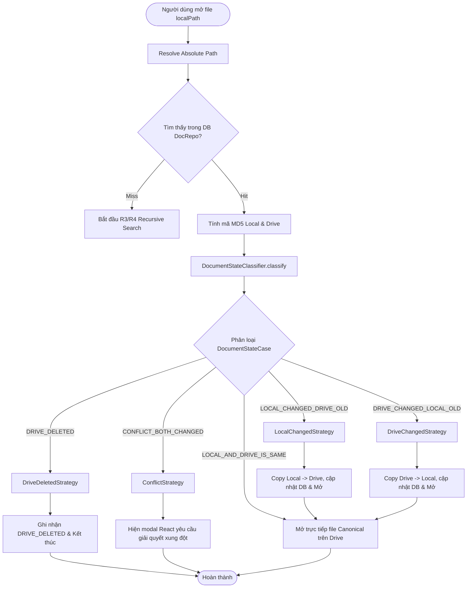
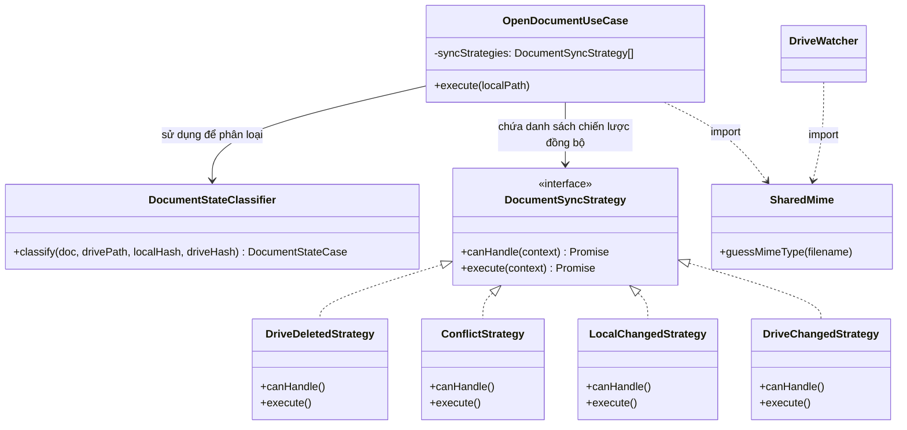

# Refactoring - Kiến Trúc Đồng Bộ & Phân Loại Trạng Thái

Tài liệu này trình bày chi tiết về cấu trúc thiết kế sau khi tái cấu trúc (refactoring) luồng xử lý mở và đồng bộ tài liệu từ Google Drive về Local và ngược lại.

---

## 1. Sơ Đồ Quy Trình Phân Loại Trạng Thái & Đồng Bộ (Pipeline Flowchart)

Quy trình hoạt động khi xảy ra một Database Hit (R2) khi mở một file:

---

## 2. Danh Sách Trạng Thái Đồng Bộ (`DocumentStateCase`)

Các trạng thái được phân loại tường minh bằng enum `DocumentStateCase`:

| Trạng thái (Enum)             | Điều kiện kích hoạt                                                                                                | Hành vi xử lý (Strategy)                                                                                      |
| :---------------------------- | :----------------------------------------------------------------------------------------------------------------- | :------------------------------------------------------------------------------------------------------------ |
| **`DRIVE_DELETED`**           | File mirror trên Google Drive không còn tồn tại vật lý trên đĩa.                                                   | Đánh dấu trạng thái tài liệu là `DRIVE_DELETED` để giao diện phản hồi cho người dùng.                         |
| **`CONFLICT_BOTH_CHANGED`**   | Cả file Local và Drive đều có hash thay đổi khác với hash được lưu trong DB, đồng thời hash của hai bên khác nhau. | Hiển thị modal để người dùng chọn phương án giải quyết (ghi đè local, ghi đè drive, đổi tên giữ cả hai...).   |
| **`LOCAL_CHANGED_DRIVE_OLD`** | Chỉ có file Local có hash thay đổi so với DB. File Drive giữ nguyên hash cũ.                                       | Tự động sao chép (copy) dữ liệu từ Local đè lên file Drive để đảm bảo bản sao lưu luôn mới nhất trước khi mở. |
| **`DRIVE_CHANGED_LOCAL_OLD`** | Chỉ có file Drive có hash thay đổi so với DB. File Local giữ nguyên hash cũ.                                       | Tự động sao chép (copy) ngược lại từ Drive về Local để cập nhật nội dung mới nhất về máy trạm trước khi mở.   |
| **`LOCAL_AND_DRIVE_IS_SAME`** | Hash của cả hai bên khớp hoàn toàn với bản ghi cuối trong Database hoặc chưa có thay đổi nào.                      | Mở trực tiếp file canonical bằng ứng dụng hệ điều hành mà không cần đồng bộ hay cảnh báo.                     |

---

## 3. Sơ Đồ Cấu Trúc Các Lớp (Class & Dependency Cleanliness)

Tách biệt trách nhiệm rõ ràng theo mô hình Clean Architecture:

---

## 4. Các Tối Ưu Khác (Clean Code)

- **Loại bỏ trùng lặp logic**: Rút gọn hàm đoán định MIME type `guessMimeType` dùng chung vào `@shared/utils/mime` thay vì copy-paste ở nhiều class.
- **Tách biệt Adapter**: Di chuyển class `ElectronUserInteractor` ra khỏi file bootstrap khởi động ứng dụng chính `src/main/index.ts` để đảm bảo file chính gọn gàng và dễ bảo trì.
